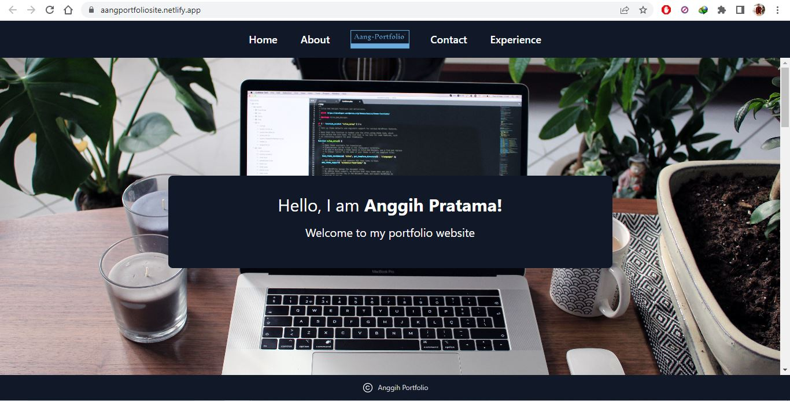

# My Portfolio Site

This is my personal portfolio website

## Links/URLs:

- Portfolio Site on Netllify: <https://aangportfoliosite.netlify.app/>

- CV: [My-Professional-CV](https://drive.google.com/file/d/1JDs8XbTT_KQADb-yTomEUh4oWn14qzTe/view?usp=share_links)

## My Portfolio Website Project Preview

## My Personal and Group Project

- Mockup on Figma: [W2-Project-MockUp&Prototyping-Anggih](https://www.figma.com/file/0iNUGujoGtRpP9aDt1xYca/W2-Project-MockUp%26Prototyping-Anggih)

- Prototyping on Figma: [W2-Project-MockUp&Prototyping-Anggih](https://www.figma.com/proto/0iNUGujoGtRpP9aDt1xYca/W2-Project-MockUp%26Prototyping-Anggih)

- My Landing Website Design [Landing-Website](http://mancity-anggih.site/)

- Website: [w5gd-lamborghinicompany.anggihp.site](http://w5gd-lamborghinicompany.anggihp.site/)

- Website on Netlify Deployment: [w5-groupd-lamborghini-anggihp.netlify.app](https://w5-groupd-lamborghini-anggihp.netlify.app/)

- Wireframe on Miro: [W5-GroupProject-groupd-wireframe](https://miro.com/app/board/uXjVPpQ9OSU=/)

- MockUp on Figma: [W5-GroupProject-groupd-MockUp&Prototyping](https://www.figma.com/file/MzVVRCsUrWzau8hmM8px8W/W5-GroupProject-groupd-MockUp%26Prototyping)

- Prototyping on Figma: [W5-GroupProject-groupd-MockUp&Prototyping](https://www.figma.com/proto/MzVVRCsUrWzau8hmM8px8W/W5-GroupProject-groupd-MockUp%26Prototyping)
